# Fraud Detection (Imbalanced) — ML baselines + selección por costo

Este repo entrena y compara modelos clásicos de fraud detection sobre el dataset Credit Card Fraud (2013), que es altamente desbalanceado (fraude ≈ 0.17%). El foco no es solo tener buen AUC, sino definir una política operativa razonable y qué casos alertar bajo un criterio de costo.

La implementación está pensada para ser reproducible:
- splits fijos (train set + test + set de validacion)
- búsqueda de hiperparámetros con PR-AUC 
- selección de umbral en validación según una función de costo
- validacion final

---

## Dataset

Las features `V1..V28` provienen de una transformación tipo PCA (por confidencialidad). `Time` y `Amount` no están transformadas.
- `Class = 1` es fraude
- `Class = 0` es no fraude

---

## Enfoque

### 1) Modelos probados
Se probaron baselines típicos para tabular desbalanceado:
- **Regresión logística** (baseline lineal e interpretable)
- **SGDClassifier (log_loss)** como aproximación eficiente a un clasificador lineal tipo SVM/logística regularizada
- **Random Forest**
- **HistGradientBoostingClassifier**

### 2) Búsqueda de hiperparámetros
Se usa `RandomizedSearchCV` con validación cruzada estratificada y  PR-AUC, porque con desbalance extremo la accuracy no es informativa.

### 3) Métricas
Se reportan dos tipos de métricas:

**Ranking (threshold-free):**
- **PR-AUC (Average Precision)** (principal en desbalance)
- **ROC-AUC** (referencia)

**Operativas (con capacidad limitada o decisión binaria):**
- **Recall@K** (si puedo revisar solo K alertas, cuánto fraude capturo)
- **Costo** con umbral elegido en validación

### 4) Función de costo
Se define un costo simple inspirado en un flujo antifraude:

- **FP** (alerta falsa): costo fijo (revisión/fricción)
- **FN** (fraude que se escapa): costo monetario proporcional a `Amount`

\[
\text{costo} = \text{FP} \cdot 1 \; + \; \sum(\text{Amount de los FN})
\]

El umbral se elige en test minimizando este costo y luego se congela para validación.

---

## Selección de mejor modelo por dos criterios

En fraude conviene separar qué tan bien rankea vs cómo lo opero. Por eso se reportan dos ganadores:

1) **min cost:** modelo que minimiza el costo en *validación* (con su threshold óptimo).
2) **best rank:** modelo con mejor PR-AUC en CV (ranking), y luego se le fija el threshold por costo en validación.

---

## Resultados (ganadores)


| Criterio | Modelo | CV PR-AUC | VAL PR-AUC | TEST PR-AUC | Threshold (VAL) | TEST FP | TEST FN | TEST fn_amount_sum | TEST cost |
|---|---|---:|---:|---:|---:|---:|---:|---:|---:|
| Min cost | `linear_svm_like_sgd` | 0.7539 | 0.6888 | 0.7059 | 0.9449 | 454 | 13 | 1189.22 | 1643.22 |
| Best rank | `hist_gradient_boosting` | 0.8403 | 0.7872 | 0.8098 | 0.0010 | 961 | 11 | 1167.99 | 2128.99 |

Lectura rápida:
- El ganador por **ranking** (HGB) obtiene **mejor PR-AUC**, pero con el threshold elegido por costo termina con **muchos FP** (umbral muy bajo), lo que sube el costo operativo.
- El ganador por **costo** (SGD) fue el mejor en validación para esa función de costo, pero el costo en test sube (sirve para discutir estabilidad del umbral / calibración de scores).

---

## Figuras (VAL/TEST)

### Curvas PR (Precision–Recall)
**Winner (min cost):**
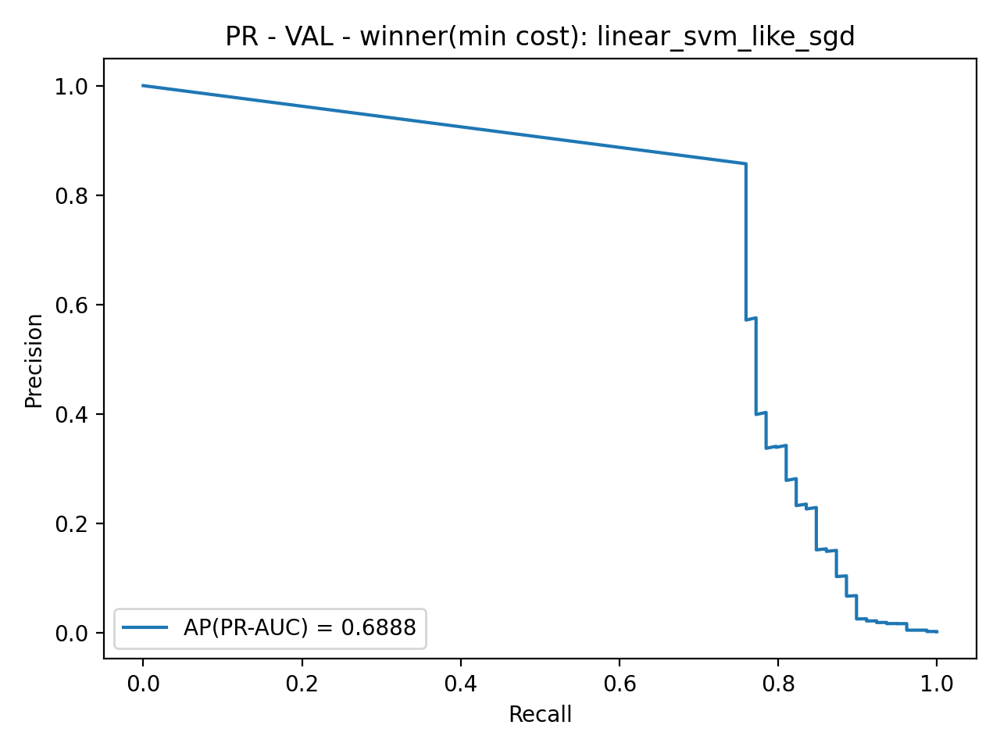
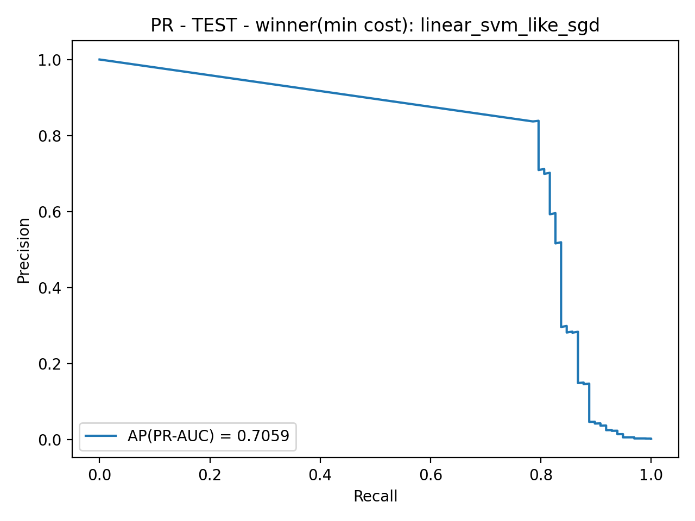

**Winner (best rank):**
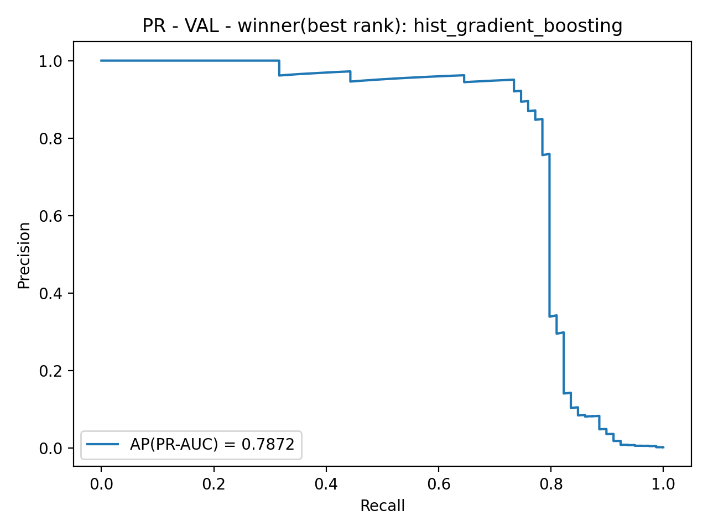
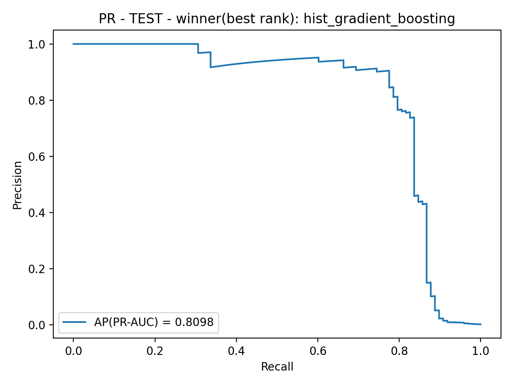

### Curvas ROC
**Winner (min cost):**
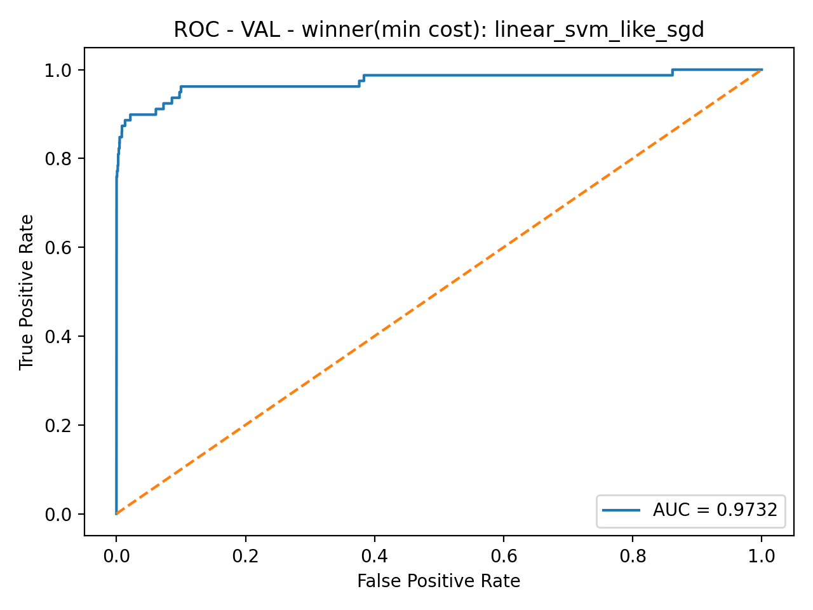


**Winner (best rank):**

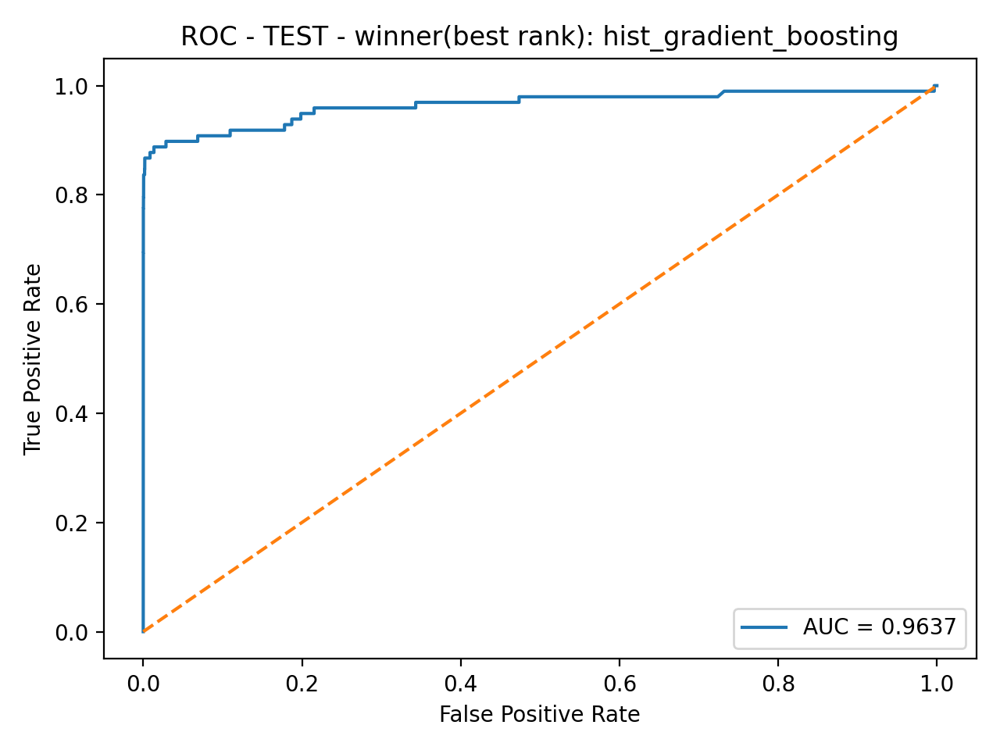

### Matriz de confusión (TEST, threshold elegido en VAL)
**Winner (min cost):**
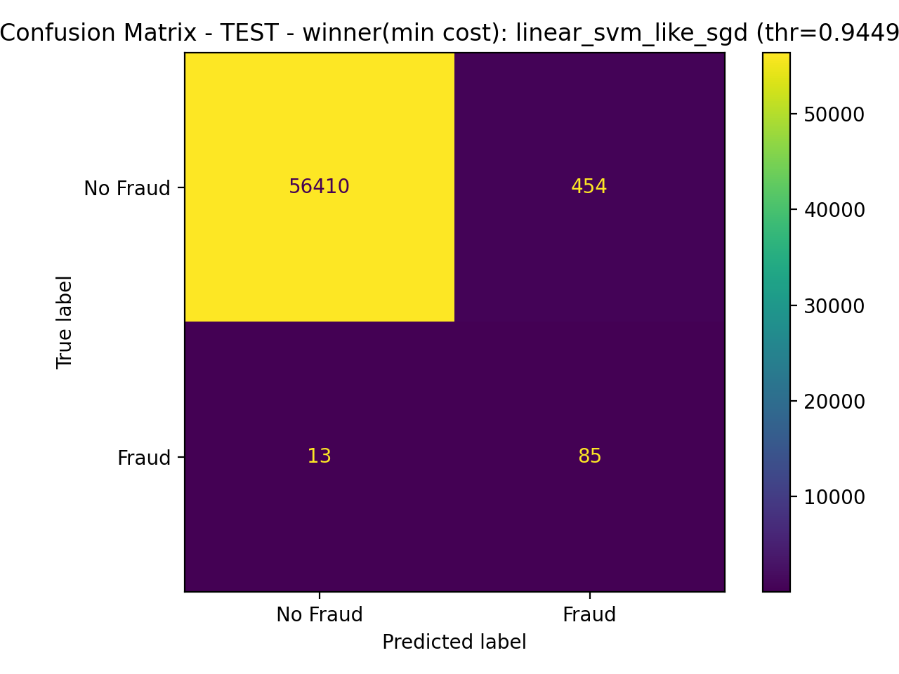

**Winner (best rank):**


### Costo vs threshold (diagnóstico operativo)
Estas curvas muestran cómo cambia el costo al mover el threshold y dónde cae el threshold elegido en validación.

**Winner (min cost):**
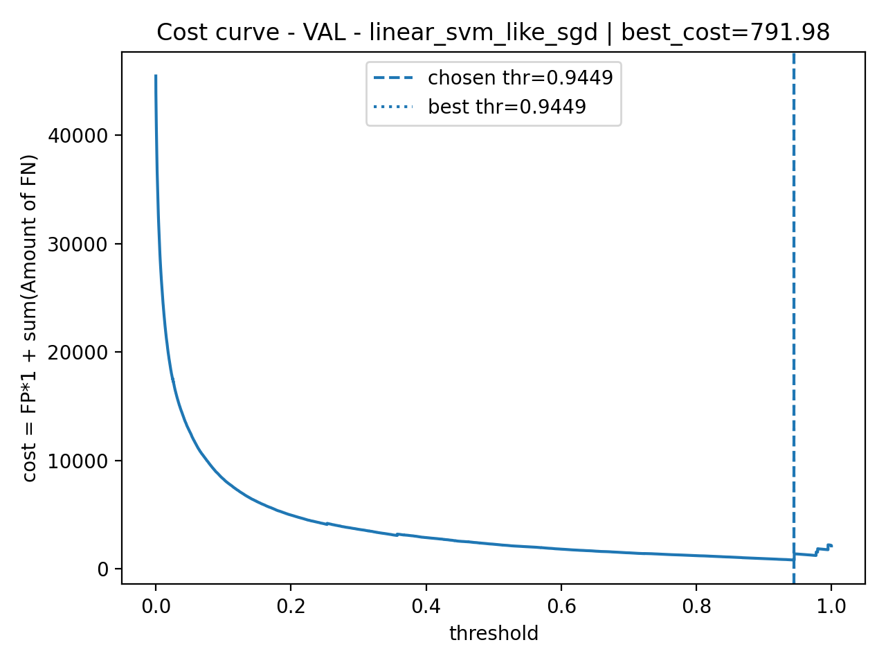
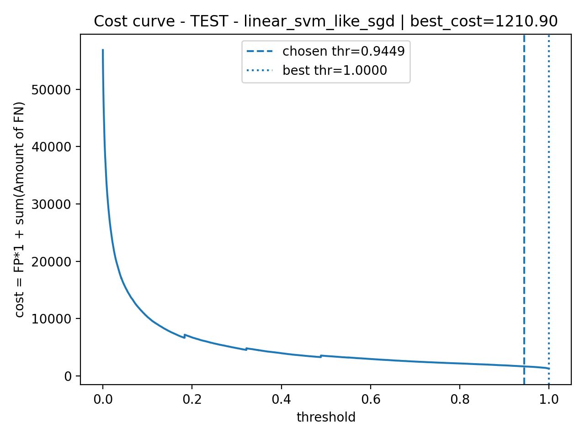

**Winner (best rank):**
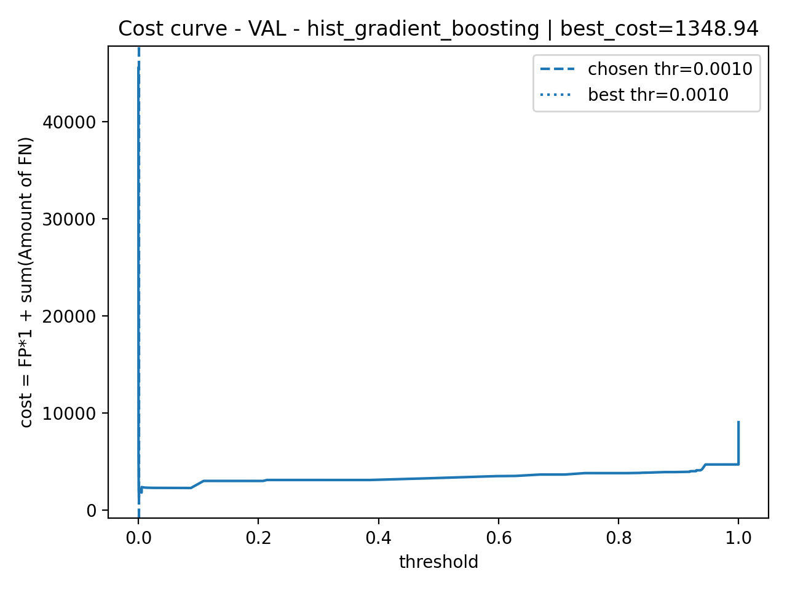
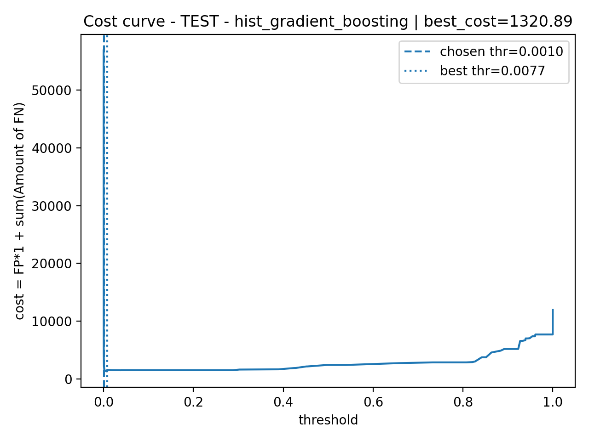

---

## Cómo reproducir

### 1) Preparar splits
Colocar el dataset en `data/creditcard.csv` y ejecutar:

```bash
python src/split_data.py
python src/split_data.py
```
Esto genera:

data/splits/train.csv
data/splits/val.csv
data/splits/test.csv

### 2) Entrenar baselines + seleccionar ganadores
python src/train_baselines.py
Outputs:

models/best_model.joblib ( por costo)

models/best_model_rank.joblib (por ranking)

models/report.json (métricas)

### 3) Generar gráficos para el README
python src/make_plots.py
Outputs:

reports/figures/*.png
reports/topk_report.txt


## Estructura del repo
data/
  creditcard.csv
  splits/
models/
  best_model.joblib
  best_model_rank.joblib
  report.json
reports/
  figures/
  topk_report.txt
src/
  split_data.py
  train_baselines.py
  make_plots.py


